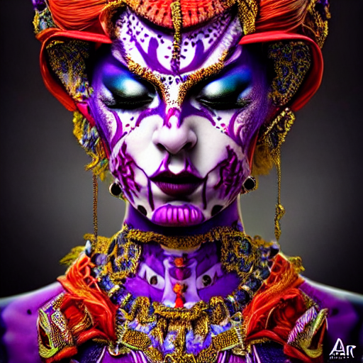
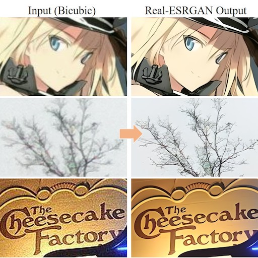
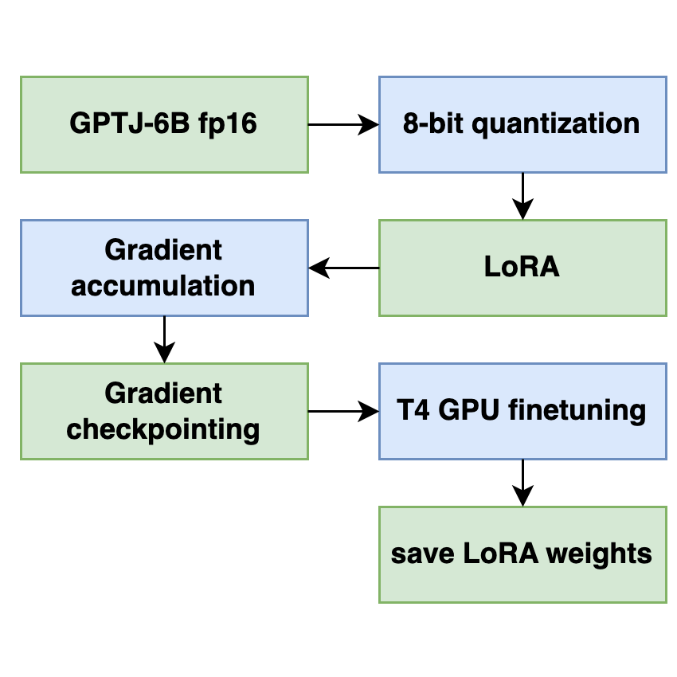
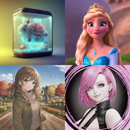
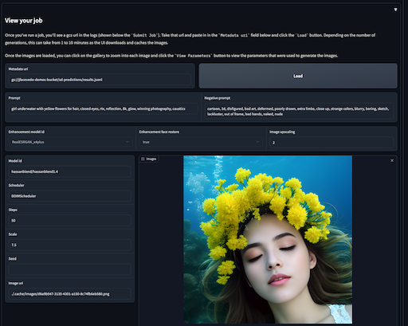

# serving-model-cards

A collection of OSS models that are containerized and ready to be served in GCP's [Vertex AI](https://cloud.google.com/vertex-ai) for easy deployment. 

By using Vertex AI endpoints, users don't need to manage complex infrastructure to serve models.
 

<b>Make sure to read the permissable license for each model before use!!</b>

| <a href="./serving-stable-diffusion">

Stable Diffusion</img> Generate images from a text prompt 

</a>| <a href="./serving-flant5">

FLAN-T5</img> Generate Text 

</a>  |<a href="./real-esrgan">

Real-ESRGAN</img> Upscale images 

</a>
| ---- | ---- | ---- |
<a href="./blip">

BLIP</img> Image captioning 

</a> | <a href="./bart">

BART</img> Summarize Text 

</a> | <a href="./instruct-tune-gptj">

Instruct GPTJ</img> Instruction tune GPTJ 

</a> | ---- | ---- | ---- |

# training-model-cards

A collection of OSS models that are containerized and ready to be trained in GCP's [Vertex AI](https://cloud.google.com/vertex-ai) for easy deployment.

| <a href="./training-dreambooth">

Train Dreambooth</img> Personalize stable diffusion 

</a> | <a href="./finetuning-stable-diffusion">

Finetune Stable Diffusion</img> Finetune stable diffusion 

</a> | <a href="./training-image-segmentation">

Image Segmentation</img> Create masks and inpaint 

</a>
|-|-|-|

# misc

A collection of different jobs and features.

| <a href="./stable-diffusion-batch-job">

Stable Diffusion Batch Job </img> Create a batch job with different styles  of stable diffusion 

</a> | <a href="./ui">

UI for Stable Diffusion Batch Job </img> Create a batch job with different styles  of stable diffusion 

</a> | <a href="./image-captioning-dataflow">

Large Scale Image Captioning with Dataflow </img> Caption millions of images at scale  using Dataflow 

</a>
|-|-|-|

# How to guides

- Stable diffusion how to guides
    - [Convert original sd checkpoint to diffusers](./stable-diffusion-how-tos/convert-sd-checkpoint-to-diffusers)
    - [Merge checkpoints](./stable-diffusion-how-tos/checkpoint-merging)