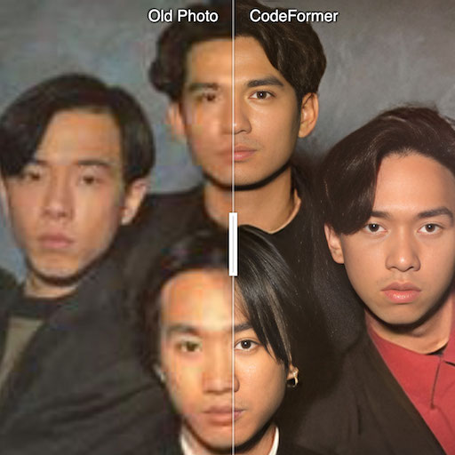

# serving-model-cards

A collection of OSS models that are containerized and ready to be served in GCP's [Vertex AI](https://cloud.google.com/vertex-ai) for easy deployment. 

By using Vertex AI endpoints, users don't need to manage complex infrastructure to serve models.
 

<b>Make sure to read the permissable license for each model before use!!</b>

| <a href="./stable-diffusion">

Stable Diffusion</img> Generate images from a text prompt 

</a>| <a href="./codeformer">

Codeformer</img> Face restoration 

</a>  |<a href="./real-esrgan">

Real-ESRGAN</img> Upscale images 

</a>
| ---- | ---- | ---- |
<a href="./blip">

BLIP</img> Image captioning 

</a>