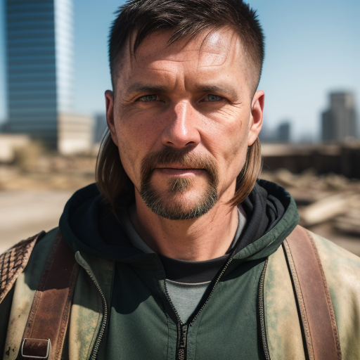
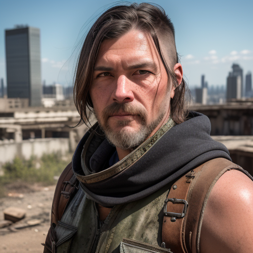

# Checkpoint merging

# Intro

This guide uses the `diffusers` library to merge checkpoints. It requires checkpoints to be in the diffusers accepted format. If you need to convert original sd checkpoints to diffusers, you can follow [this](../checkpoint-merging/README.md) guide.

# Setup

1. Install dependencies

    ```bash
    pip install omegaconf safetensors diffusers transformers torch
    ```

1. Download the models you would like to merge. In this example, we'll use one checkpoint from [civitai](https://civitai.com/).

    ```bash
    wget https://civitai.com/api/download/models/9901 -O 9901.safetensors
    wget https://civitai.com/api/download/models/6987 -O 6987.safetensors
    ```

1. Convert the checkpoint as described in the intro link. For example, if your script is named `convert.py`, do the following:

    ```bash
    python convert.py --checkpoint_path 9901.safetensors --dump_path refined_checkpoint/ --scheduler_type pndm --from_safetensors
    python convert.py --checkpoint_path 6987.safetensors --dump_path realistic_vision_v1.3_checkpoint/ --scheduler_type pndm --from_safetensors

1. First let's generate some images with the different models and the same seed to use as a reference.

    ```bash
    python generate.py
    python generate2.py
    ```

    
    

1. Merge models. 

    ```bash
    python merge.py
    ```

    